# Deploy Microservices using Spring Cloud Framework
This work is on Java Spring Cloud Deploy Microservices. Which can be accomplished by completing each task in the project:

:one: Create a Java microservice client application from an existing Spring Boot Rest application.\
:two: Create a Git configuration Repository to manage Spring Cloud configuration properties.\
:three: Create a Spring Cloud Configuration Server to manage configurations for the Microservices Application.\
:four: Create a Eureka Registry Server to manage Microservice instances and view the Spring Cloud System Status.\
:five: Use server port 8080 to locate both Spring Microservices on the same Server port using Zuul.

By end of this project you will use the spring cloud to deploy a pair of microservices that will be used to inject the pair of random numbers into the math quiz

Microservices are simply a set of small applications that can communicate with one another to create an application. The advantages of using micro services is they are quick to develop and test. In addition, they scale well when demand increases for one part of the application, and they are easier to maintain since each microservice is not strongly coupled to the other. The goal of the application within an application group accessible using the same server and port number.

## Task1: RAND
:dart: Overview of the application\
:dart: Modify build.gradle to add spring cloud and registration dependencies\
:dart: Enable the RandApplication for Eureka Registration\
:dart: Add the application properties and bootstrap properties\
:dart: check the question application files.

=============check the file in RAND=============

Note: give the command ./gradlew to run the file
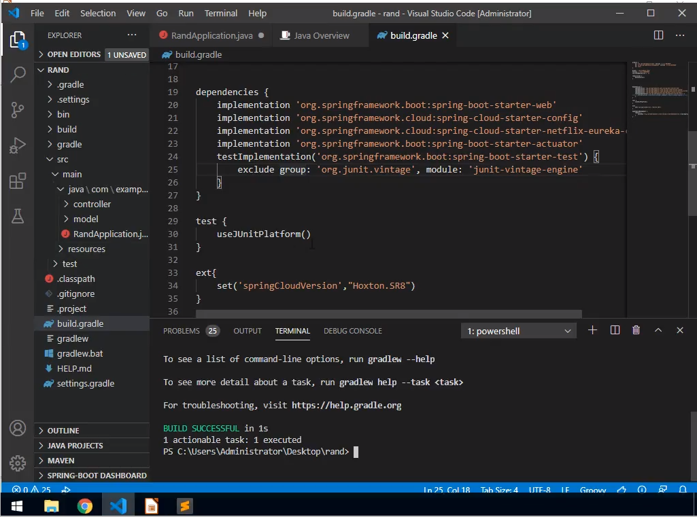
Now set the application.properties and bootstrap.properties in resouces folder with
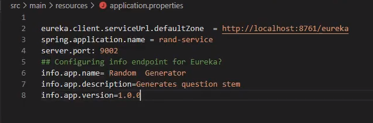

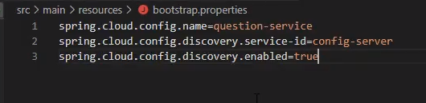

Output for task 1 is given below
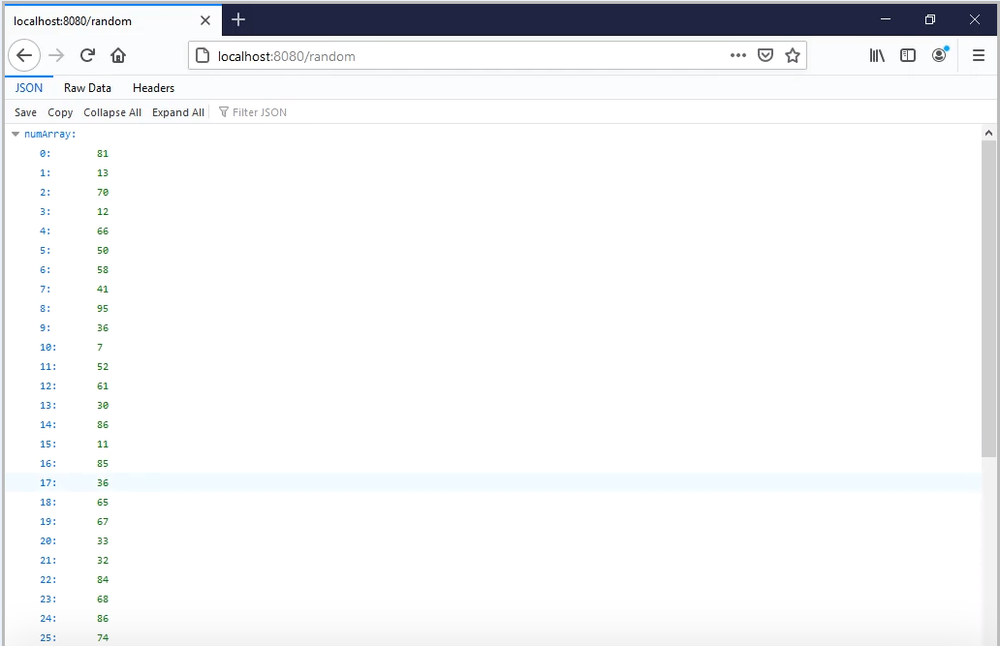

## Task2:
:dart: Spring Cloud Configuration server uses a Git repository\
:dart: Create git username and email\
:dart: Create a local gir repo to store application configuration into for the configuration server\
:dart:commit and additions to the local git repository

Lets get stsrted open your Gitbash command prompt
follow the command used in the screenshot
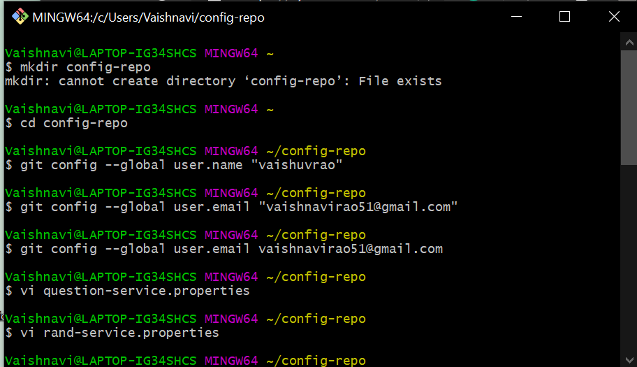
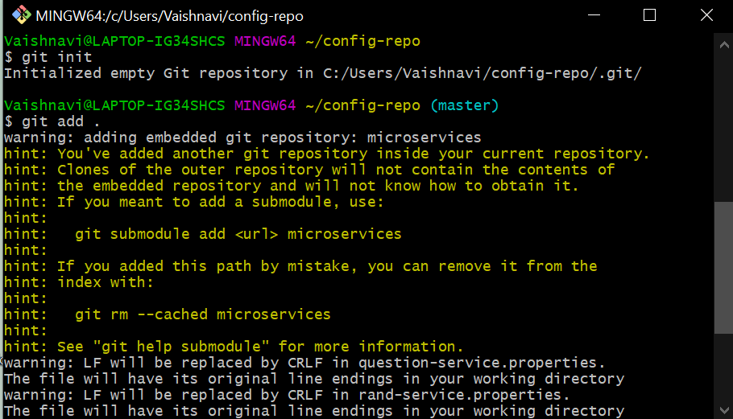
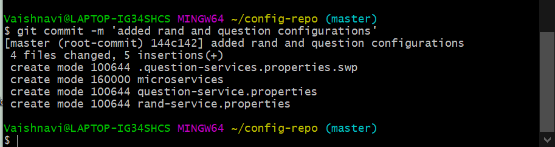

Note That in question-service.properties : server.port=9001 >> spring.application.name=question-service
and in rand-service.properties : server.port=9002 >> spring.application.name=rand-service

In this task we created a git configuration repository to manage spring cloud configuration properties.
in this task we create a s pring clod configuration server to manage configurations using repositories for the micro services application

## Task3 : SERVER
:dart: Use the Visual studio code commands to invoke spring initializer\
:dart: Add the required dependencies for the spring configuration server\
:dart identify the server port and URI for the config repository in application properties

For the server configuration in command palete -> create a gradle project -> java -> server -> JAR -> 11 -> config server, Eureka discovery client -> enter and save it in desktop -> generate new folder

In resources >> application.properties set the server.port: 8888

## Task4: REGISTRY
:dart: Use the visual studio code to create the Registry server\
:dart: Add the annotation to inject the EUreka server\
:dart: Set up the bootstrap properties and application properties

For the server configuration in command palete -> create a gradle project -> java -> registry -> JAR -> 11 -> cloud bootstrap, Eureka server -> enter and save it in desktop-> generate new folder

In resources -> application.properties set the server.port: 8761 and give these commands in gitbash
 
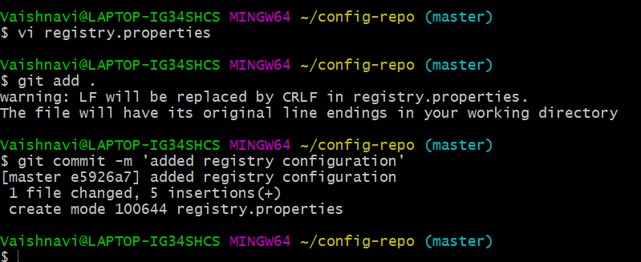

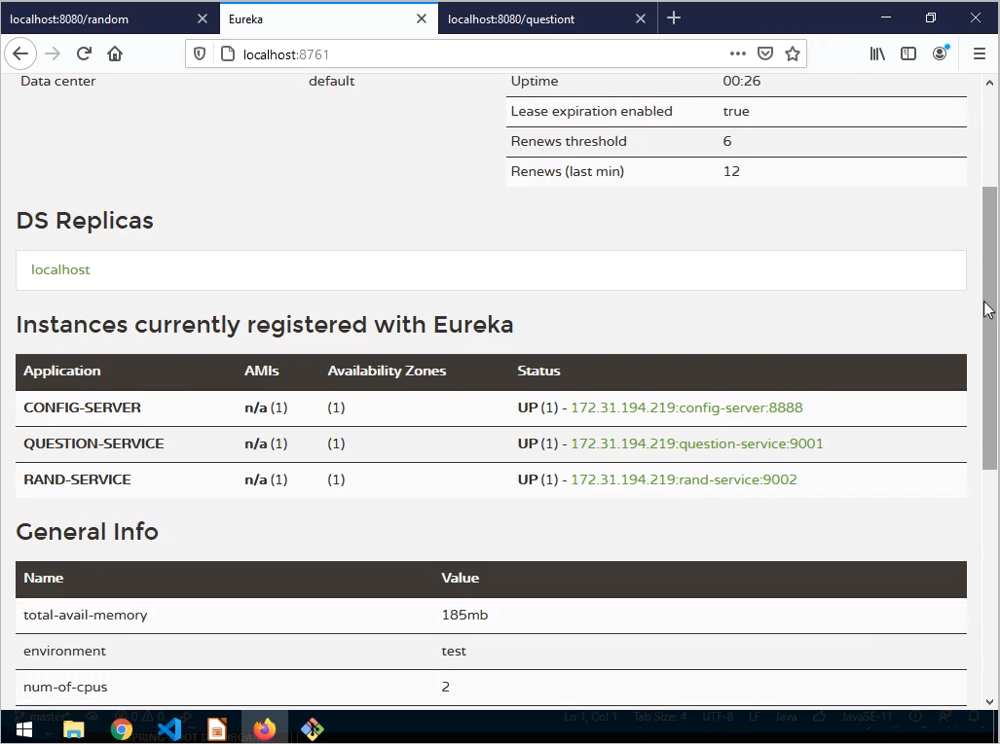

## Task4 : ROUTER
:dart: Create a new Grdle project called routing\
:dart: Enable ZUUL Proxy and Eureka client\
:dart: Add bootstrap properties\
:dart: identify the server port(8080) and ZUUL rout mapping in the application.properties

For the server configuration in command palete -> create a gradle project -> java -> router -> JAR -> 11 -> spring boot actuator, Eureka discovery client, zuul[maintainence], config client -> enter and save it in desktop-> generate new folder

In resources -> application.properties set the server.port: 8080 

### output:  
we get our random generator micro servce
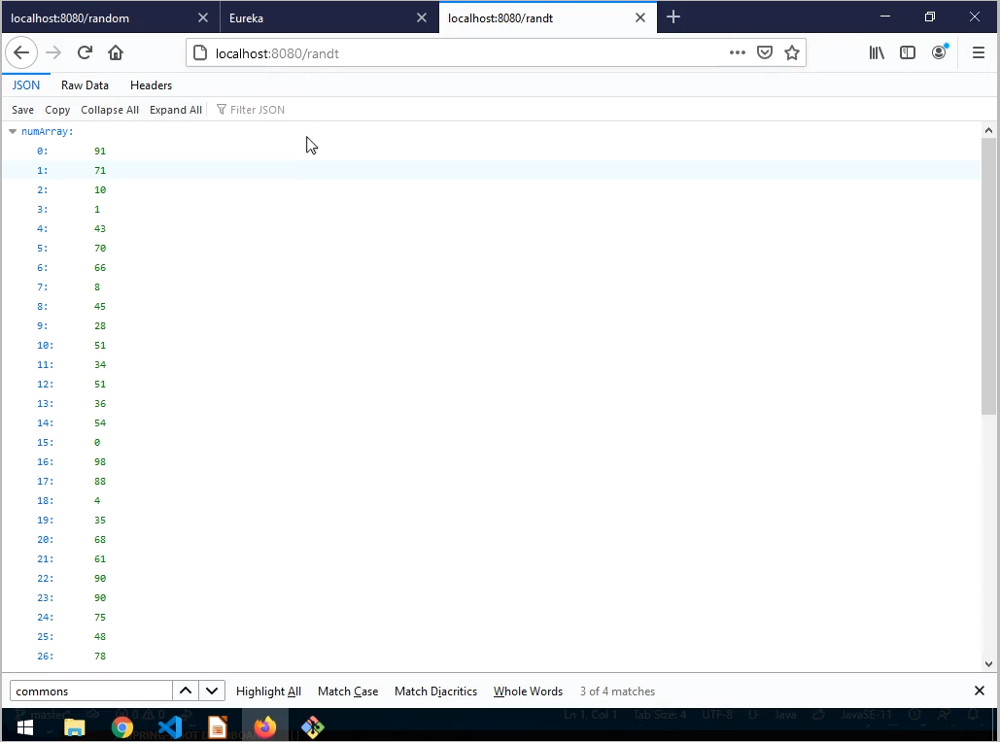

we the question for the micro services
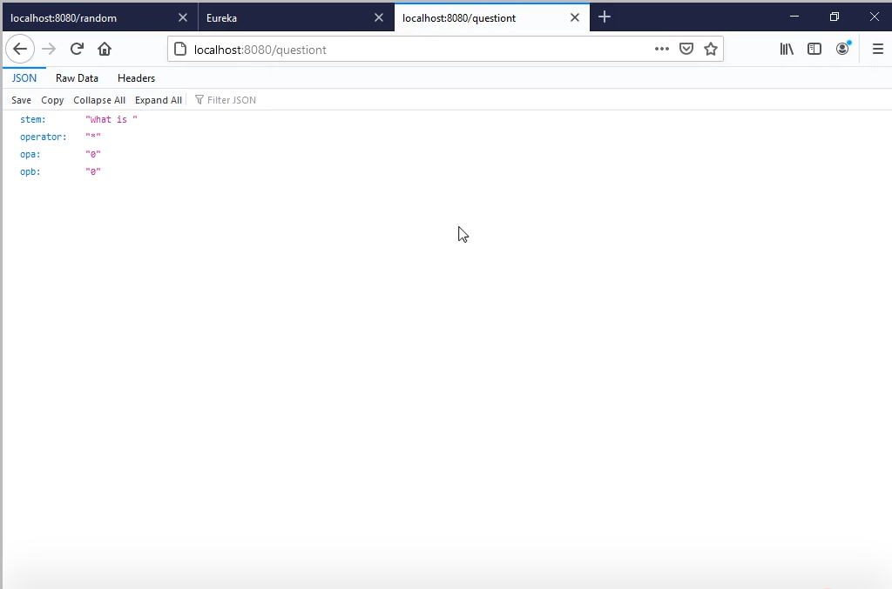
